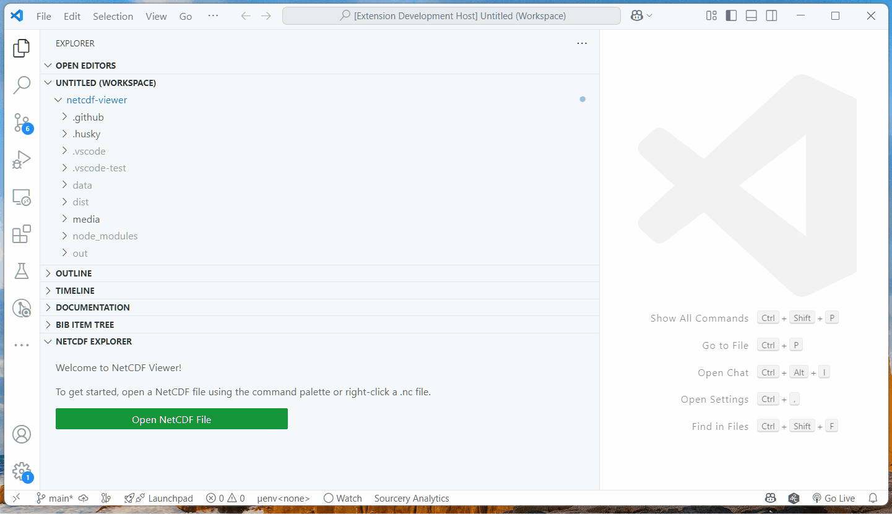

# NetCDF Viewer for VS Code

**NetCDF Viewer** is a Visual Studio Code extension that lets you explore and inspect NetCDF files (`.nc`, `.nc4`, `.cdf`, `.h5`) directly within your editor. Designed for scientists, engineers, and data analysts, this extension provides a fast, interactive way to browse datasets, view metadata, and preview sample data—without leaving VS Code.

---

## ✨ Features

- **Browse NetCDF files** in a dedicated sidebar tree view
- **Expand dimensions, coordinates, and data variables** just like in xarray
- **View variable attributes and sample data** with a simple click
- **No need for external tools**—all inspection is done in the editor
- **Python-powered backend** for robust NetCDF parsing

---

## Demonstration

1. From the Command Pallete, type `netcdf-viewer.selectPythonEnv` to select your Python environment.
2. Open a NetCDF file in the editor.
   - from the Welcome page, click on the "Open NetCDF File" button
   - or right-click a `.nc` file in the Explorer and select **Open in NetCDF Viewer**
   - or use the command palette: `NetCDF Viewer: Open File…`



## 📦 Installation

### From the VS Code Marketplace

1. Open the Extensions view (`Ctrl+Shift+X`).
2. Search for **NetCDF Viewer**.
3. Click **Install**.

### From Source

1. Clone this repository:

   ```sh
   git clone https://github.com/rmcd-mscb/netcdf-viewer.git
   cd netcdf-viewer
   ```

2. Install dependencies:

   ```sh
   npm install
   ```

3. Open the folder in VS Code:

   ```sh
   code .
   ```

4. Press `F5` to launch the extension in a new Extension Development Host window.

---

## 🐍 Python Requirements

This extension uses Python (via [xarray](https://xarray.dev/) and [netCDF4](https://unidata.github.io/netcdf4-python/)) to parse NetCDF files.

**You must have:**

- Python 3.7+
- `xarray` and `netCDF4` installed in your Python environment

If you use a custom Python path, set it in your VS Code settings:

- Select **File > Preferences > Settings** (or `Ctrl+,`)
- Search for `netcdfViewer.pythonPath`
- Set the path to your Python executable:

```markdown
"netcdfViewer.pythonPath": "/path/to/python"
```

---

## 🚀 Usage

1. **Open the NetCDF Viewer**  
   Find the **NetCDF Explorer** in the Activity Bar or Side Bar.

2. **Open a NetCDF file**  
   - Right-click a `.nc` file in the Explorer and select **Open in NetCDF Viewer**  
   - Or use the command palette: `NetCDF Viewer: Open File…`

3. **Browse your data**  
   - Expand **Dimensions**, **Coordinates**, and **Data Variables**.
   - Click on a variable to expand and see its attributes and a sample of its data.

---

## 🛠️ Development & Packaging

This extension is written in TypeScript and uses a Python script for data extraction.

**To package for VS Code:**

1. Build the extension:

   ```sh
   npm run compile
   ```

2. Package it:

   ```sh
   npx vsce package
   ```

   This will create a `.vsix` file you can install or distribute.

**To install a VSIX:**

```sh
code --install-extension netcdf-viewer-*.vsix
```

---

## 💡 Why NetCDF Viewer?

- No more switching between command-line tools and your editor
- Instantly inspect large scientific datasets
- Works cross-platform (Windows, macOS, Linux)
- Familiar xarray-like organization

---

## 📝 Feedback & Issues

Found a bug or have a feature request?  
[Open an issue on GitHub](https://github.com/rmcd-mscb/netcdf-viewer/issues).

---

## 📄 License

Please see [LICENSE.md](LICENSE.md) for details.

---

## Contributing

Please see [CONTRIBUTING.md](CONTRIBUTING.md) for guidelines on setting up your development environment and making contributions.

---

## Changelog

See [CHANGELOG.md](CHANGELOG.md) for a history of changes to this project.

---

**Happy data exploring!**
