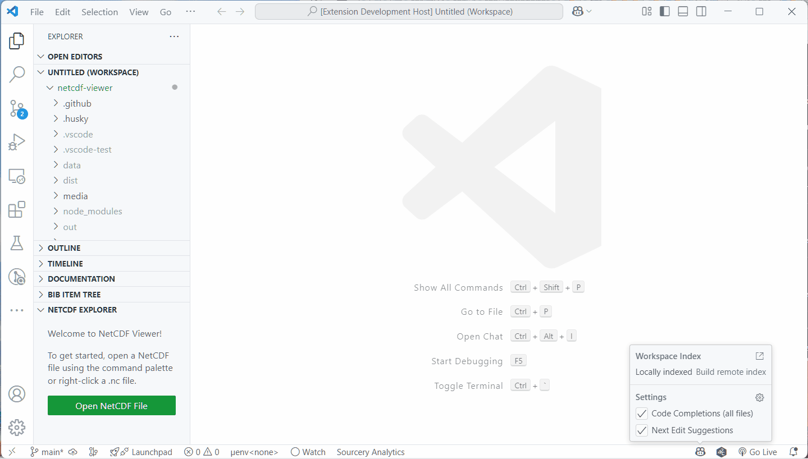

# NetCDF Viewer for VS Code

**NetCDF Viewer** is a Visual Studio Code extension that lets you explore and inspect NetCDF files (`.nc`, `.nc4`, `.cdf`, `.h5`) directly within your editor. Designed for scientists, engineers, and data analysts, this extension provides a fast, interactive way to browse datasets, view metadata, and preview sample data—without leaving VS Code.

---

## ✨ Features

- **Browse NetCDF files** in a dedicated sidebar tree view
- **Expand dimensions, coordinates, and data variables** just like in xarray
- **View variable attributes and sample data** with a simple click
- **No need for external tools**—all inspection is done in the editor
- **Python-powered backend** for robust NetCDF parsing

## 📂 Supported Formats & Limitations

- Works with local NetCDF files: `.nc`, `.nc4`, `.cdf`, `.h5`.
- Primarily tested with NetCDF4/HDF5—older NetCDF3 files may not display all metadata.
- Only a small preview of each variable (first ten values) is shown in the tree view.
- Loading extremely large files can take additional time and memory.

---

## Demonstration

1. From the Command Palette, type `netcdf-viewer.selectPythonEnv` to select your Python environment.

   

2. Open a NetCDF file in the editor.
   - from the Welcome page, click on the "Open NetCDF File" button

      

   - or right-click a `.nc` file in the Explorer and select **Open in NetCDF Viewer**

      

   - or use the command palette: `NetCDF Viewer: Open File…`

      

## 📦 Installation

### From the VS Code Marketplace

1. Open the Extensions view (`Ctrl+Shift+X`).
2. Search for **NetCDF Viewer**.
3. Click **Install**.

### From Source

1. Clone this repository:

   ```sh
   git clone https://github.com/rmcd-mscb/netcdf-viewer.git
   cd netcdf-viewer
   ```

2. Install dependencies:

   ```sh
   npm install
   ```

3. Open the folder in VS Code:

   ```sh
   code .
   ```

4. Press `F5` to launch the extension in a new Extension Development Host window.

## 🔄 Updating & Uninstalling

### Updating

- **Marketplace**: Open the Extensions view and click the refresh icon to check for updates (or enable auto-update).
- **VSIX**: Download the latest `.vsix` and run `code --install-extension netcdf-viewer-<version>.vsix`.

### Uninstalling

1. Open the Extensions view (`Ctrl+Shift+X`).
2. Locate **NetCDF Viewer** in your installed extensions.
3. Click the gear icon and choose **Uninstall**.

---

## 🐍 Python Requirements

This extension uses Python (via [xarray](https://xarray.dev/) and [netCDF4](https://unidata.github.io/netcdf4-python/)) to parse NetCDF files.

**Requirements:**

- Python 3.8 or higher
- `xarray` and `netCDF4` packages

### Installation Options

**Using pip:**

```sh
pip install xarray netCDF4
```

**Using conda:**

```sh
conda install -c conda-forge xarray netCDF4
```

**Using the provided environment file:**

```sh
conda env create -f environment.yml
conda activate netcdf-viewer
```

### Configuration

If VS Code doesn't find Python automatically, set the path in your settings:

1. Open Command Palette (`Ctrl+Shift+P`)
2. Run "Select Python Environment for NetCDF Viewer"
3. Choose your Python executable

Or manually in `settings.json`:

```json
"netcdfViewer.pythonPath": "/path/to/python"
```

### Settings

| Setting | Default | Description |
|---------|---------|-------------|
| `netcdfViewer.pythonPath` | `python` | Path to Python executable |
| `netcdfViewer.sampleSize` | `10` | Number of sample values to display per variable (1-1000) |

### Troubleshooting

| Problem | Solution |
|---------|----------|
| "Python, xarray, or netCDF4 not found" | Ensure packages are installed and `pythonPath` is set correctly |
| Extension doesn't detect Python | Use the "Select Python Environment" command |
| Large files are slow | This is normal; consider using a subset of your data |

---

## 🚀 Usage

1. **Open the NetCDF Viewer**  
   Find the **NetCDF Explorer** in the Activity Bar or Side Bar.

2. **Open a NetCDF file**  
   - Right-click a `.nc` file in the Explorer and select **Open in NetCDF Viewer**  
   - Or use the command palette: `NetCDF Viewer: Open File…`

3. **Browse your data**  
   - Expand **Dimensions**, **Coordinates**, and **Data Variables**.
   - Click on a variable to expand and see its attributes and a sample of its data.

---

## 🛠️ Development & Packaging

This extension is written in TypeScript and uses a Python script for data extraction.

**To package for VS Code:**

1. Build the extension:

   ```sh
   npm run compile
   ```

2. Package it:

   ```sh
   npx vsce package
   ```

   This will create a `.vsix` file you can install or distribute.

**To install a VSIX:**

```sh
code --install-extension netcdf-viewer-*.vsix
```

---

## 💡 Why NetCDF Viewer?

- No more switching between command-line tools and your editor
- Instantly inspect large scientific datasets
- Works cross-platform (Windows, macOS, Linux)
- Familiar xarray-like organization

---

## 📝 Feedback & Issues

Found a bug or have a feature request?  
[Open an issue on GitHub](https://github.com/rmcd-mscb/netcdf-viewer/issues).

---

## 📄 License

Please see [LICENSE.md](LICENSE.md) for details.

---

## Contributing

Please see [CONTRIBUTING.md](CONTRIBUTING.md) for guidelines on setting up your development environment and making contributions.

---

## Changelog

See [CHANGELOG.md](CHANGELOG.md) for a history of changes to this project.

---

**Happy data exploring!**
